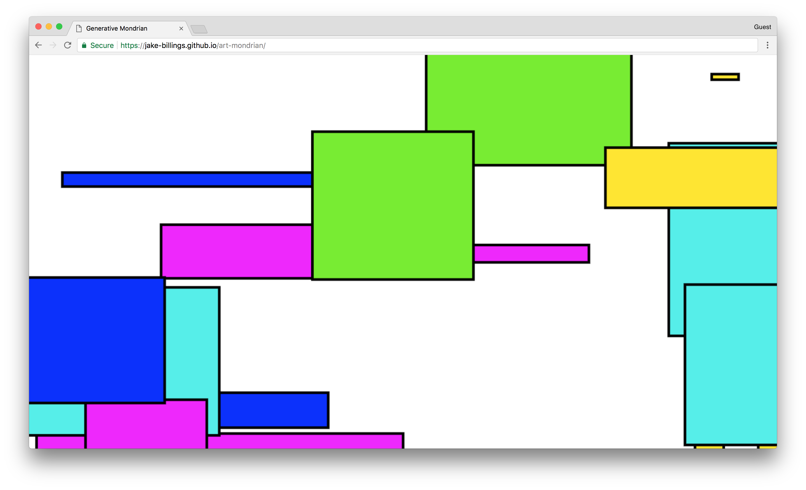
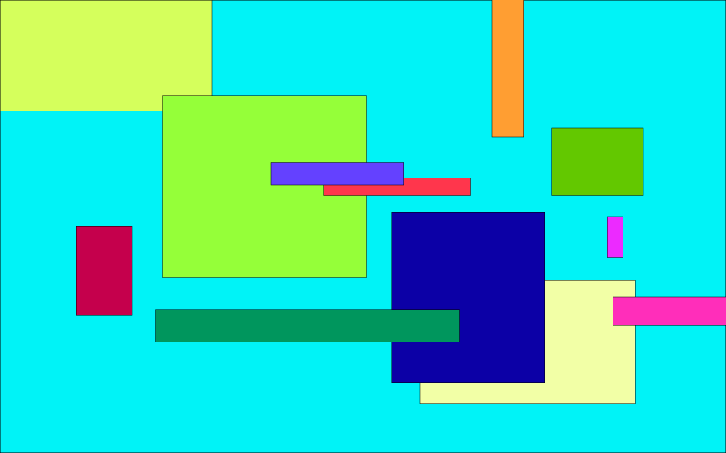

# art-mondrian #
Procedurally generated rectangular art.

See the results here [https://jake-billings.github.io/art-mondrian](https://jake-billings.github.io/art-mondrian).
## Inspiration ##
One day, I was late for the bus to School of Mines before a meeting for the project [https://github.com/jake-billings/research-alzheimers](https://github.com/jake-billings/research-alzheimers). So, I decided to draw some random rectangles on Adobe Illustrator at the Auraria Library in Denver. It looks kind of like the work of [Piet Mondrian](https://en.wikipedia.org/wiki/Piet_Mondrian).

### Manual Art Creation using Illustrator ###

### Manual Art Creation by Piet Mondrian ###

